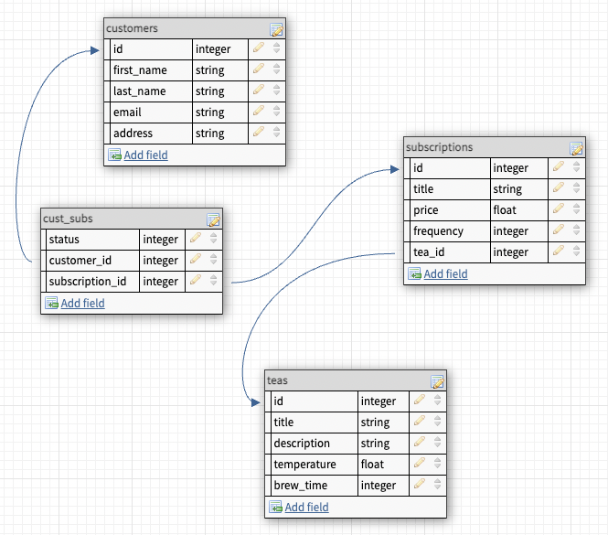

# README
## Tea's Seat

A tea subscription service that provides the ability to view a customer's subscriptions, allow the assignment of new subscriptions to a customer, and gives the chance to set currently assigned subscriptions as cancelled.

<a name="readme-top"></a>

<details>
  <summary>Table of Contents</summary>
  <ul list-style-position="inside">
    <li>
      <a href="#about-the-project">About The Project</a>
      <ul>
        <li><a href="#learning-goals">Learning Goals</a></li>
        <li><a href="#built-with">Built With</a></li>
        <li><a href="#roadmap">Roadmap</a></li>
      </ul>
    </li>
    <li>
      <a href="#getting-started">Getting Started</a>
      <ul>
        <li><a href="#prerequisites">Prerequisites</a></li>
        <li><a href="#installation">Installation</a></li>
      </ul>
    </li>
    <li>
      <a href="#usage">Usage</a>
      <ul>
        <li><a href="#endpoints">Endpoints</a></li>
      </ul>
    </li>
    <li>
      <a href="#contributing">Contributing</a>
      <ul>
        <li><a href="#developers">Developers</a></li>
        <li><a href="#project-managers-instructors">Project Managers-Instructors</a></li>
      </ul>
    </li>
  </ol>
</details>

## About the Project
  
  ### Production Links
  
  * [Github](https://github.com/bgray88/teas_seat) <br>

  ### Learning Goals

  * Microservice integration and implementation
  * Service integration and implementation
  * Efficient API exposure

  ### Built With

  [![Ruby]][Ruby-url] [![Rails]][Rails-url][![Postgres]][Postgres-url]
  [![Postman]][Postman-url]

  ### Roadmap
  <details>
    <summary>Done</summary>
    - [x] Design Schema<br>
    - [x] Add Readme<br>
    - [x] Setup Repo and Push to Github<br>
    - [x] Readme: Outlines the learning goals<br>
    - [x] Readme: Clone and Setup<br>
    - [x] Readme: Happy Path Endpoint Use<br>
    - [x] Endpoints: Customers<br>
    - [x] Endpoints: Subscription<br>
    - [x] Endpoints: Teas<br>
    - [x] Testing: Customers<br>
    - [x] Testing: Subscription<br>
    - [x] Testing: Teas<br>
    - [x] Testing: Expanded Sad Path<br>
  </details>
  <details>
    <summary>In Progress</summary>
  </details>

  <p align="right">(<a href="#readme-top">back to top</a>)</p>

## Getting Started

  ### Prerequisites

  * Ruby 2.7.4
  * Rails 5.2.8

  ### Installation

  _Below are instructions for forking and cloning this repo_

  1. Clone the repo
  ```sh
  git clone git@github.com:bGray88/teas_seat.git
  ```
  2. Install gems
  ```sh
  bundle install
  ```
  3. Setup the database
  ```js
  rails db:{create,migrate,seed}
  ```
  4. Run RSpec tests
  ```sh
  bundle exec rspec
  ```

  <p align="right">(<a href="#readme-top">back to top</a>)</p>

## Usage
  
  ### Schema

  

  ### Endpoints

  <details>
  <summary>Customer Subscriptions: Create</summary><br>
  
  ### Create

  Example Request:

  ```js
  POST /api/v1/cust_sub

  {
    "customer": {
      "customer_id": 1
    },
    "subscription": {
      "subscription_id": 2
    }
  }
  ```

  Example Response:

  ```js
  {
    "data": {
      "type": "subscription",
      "id": 2,
      "attributes": {
        "title": "Silver",
        "price": "$82.10",
        "status": "active",
        "frequency": "biannual",
        "tea": {
          "type": "tea",
          "id": 8,
          "attributes": {
              "title": "Osmanthus",
              "description": "You may drink it",
              "temperature": "cold",
              "brew_time": 8
          }
        }
      }
    }
  }
  ```

  </details>

  <details>
  <summary>Customer Subscriptions: Index</summary><br>

  ### Index

  Example Request:

  ```js
  GET /api/v1/cust_subs

  {
    "customer": {
      "customer_id": 1
    }
  }
  ```

  Example Response:

  ```js
  {
    "data": [
      {
        "type": "subscription",
        "id": 7,
        "attributes": {
          "title": "Premium",
          "price": "$37.53",
          "status": "active",
          "frequency": "biannual",
          "tea": {
            "type": "tea",
            "id": 2,
            "attributes": {
              "title": "Kukicha",
              "description": "You may drink it",
              "temperature": "hot",
              "brew_time": 10
            }
          }
        }
      },
      {
        "type": "subscription",
        "id": 2,
        "attributes": {
          "title": "Basic",
          "price": "$80.83",
          "status": "cancelled",
          "frequency": "monthly",
          "tea": {
            "type": "tea",
            "id": 9,
            "attributes": {
              "title": "Gongmei",
              "description": "You may drink it",
              "temperature": "cold",
              "brew_time": 6
            }
          }
        }
      }
    ]
  }
  ```

  </details>


  <details>
  <summary>Customer Subscriptions: Update</summary><br>

  ### Update

  Example Request:

  **Available Statuses: 'active', 'cancelled'**

  ```js
  PATCH /api/v1/cust_sub

  {
    "cust_sub": {
      "id": 3
    },
    "status": "cancelled"
  }
  ```

  Example Response:

  ```js
  {
    "message": "Subscription updated successfully"
  }
  ```

  </details>

  <p align="right">(<a href="#readme-top">back to top</a>)</p>

## Contributing

  Contributions are what make the open source community such an amazing place to learn, inspire, and create. Any contributions you make are **greatly appreciated**.

  If you have a suggestion that would make this better, please fork the repo and create a pull request. You can also simply open an issue with the tag "enhancement".
  Don't forget to give the project a star! Thanks again!

  1. Fork the Project
  2. Create your Feature Branch (`git checkout -b feature/AmazingFeature`)
  3. Commit your Changes (`git commit -m 'Add some AmazingFeature'`)
  4. Push to the Branch (`git push origin feature/AmazingFeature`)
  5. Open a Pull Request

  ### Developers

  <div align="center">
    
    <p align="center">
      Brandon Gray<br>
      <a href="https://github.com/bGray88">Github: bGray88</a><br>
      <a href="https://www.linkedin.com/in/brandon-gray-67903689/">LinkedIn: Brandon Gray</a>
    </p>
  </div>

  <p align="right">(<a href="#readme-top">back to top</a>)</p>

  ### Project Managers-Instructors

  1. Juliet Eyraud
  1. Leta Keane

  <p align="right">(<a href="#readme-top">back to top</a>)</p>

  [Ruby]: https://img.shields.io/badge/-Ruby-CC342D?style=flat&logo=ruby&logoColor=white
  [Ruby-url]: https://www.ruby-lang.org/en/
  [Rails]: https://img.shields.io/badge/-Ruby%20on%20Rails-CC0000?style=flat&logo=rubyonrails&logoColor=white
  [Rails-url]: https://rubyonrails.org
  [Postgres]: https://img.shields.io/badge/-Postgres-4169E1?style=flat&logo=postgresql&logoColor=white
  [Postgres-url]: https://www.postgresql.org/
  [Postman]: https://img.shields.io/badge/-Postman-FF6C37?style=flat&logo=postman&logoColor=white
  [Postman-url]: https://www.postman.com/
